<p align="center">
  
</p>

<h1 align="center">VitaIRC</h1>

<p align="center">
  A native, lightweight IRC client for the PlayStation Vita<br>
  with <b>ChatGPT translation</b>, <b>Imgur uploads</b>, an image viewer and bouncer support.
</p>

<p align="center">
  
  
  
  
</p>

<p align="center">
  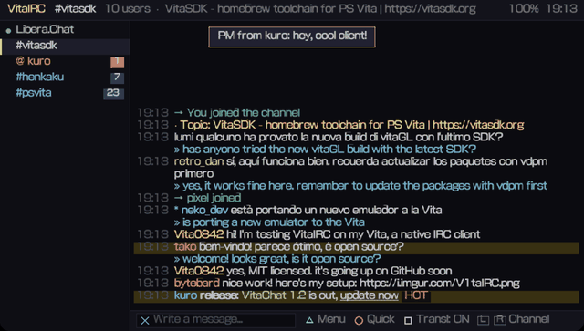
</p>

<p align="center"><i>Español: <a href="README.es.md">README.es.md</a></i></p>

---

VitaIRC is a homebrew IRC client written in C for HENkaku/Ensō-enabled PS Vita consoles. It talks to
IRC servers directly from the console: no PC, server or companion app needed. It was made to give
something back to the Vita scene, and it is fully open source.

## Contents

- [Features](#features)
- [Screenshots](#screenshots)
- [Installation](#installation)
- [Getting started](#getting-started)
- [Controls](#controls)
- [Commands](#commands)
- [Translation with ChatGPT](#translation-with-chatgpt)
- [Images: Imgur, camera and viewer](#images-imgur-camera-and-viewer)
- [Logging in to Libera.Chat (SASL)](#logging-in-to-liberachat-sasl)
- [Never miss a message: bouncers](#never-miss-a-message-bouncers)
- [Configuration file](#configuration-file)
- [Updating](#updating)
- [Where your data lives](#where-your-data-lives)
- [Limitations](#limitations)
- [Building from source](#building-from-source)
- [Project layout](#project-layout)
- [Development tools](#development-tools)
- [Credits](#credits)
- [License](#license)

## Features

**IRC**
- Several networks at once, SSL/TLS (mbedTLS) and automatic reconnection.
- **Automatic login**: SASL PLAIN, NickServ or server password. With a password set, VitaIRC
  identifies by itself and **takes your nick back** if a previous session is still holding it.
- Channels, private messages, user lists with op/voice prefixes and away status.
- IRCv3: `server-time`, `multi-prefix`, `away-notify`, perfect for bouncers.
- **mIRC colors, bold and underline** rendered on screen (can be turned off).
- **Highlight words** besides your nick, unread counters, pop-up notifications and an optional **chime**.
- **Ignore list** with wildcards and private-message **flood protection**.
- **Operator tools** from the user list: op/deop, voice/devoice, kick, ban.
- `/away`, invitations with a *"Join?"* prompt, channel browser (`/list`).
- **Search** inside a channel and **jump to your last mention**.
- **Network presets**: Libera.Chat, OFTC, EFnet, Rizon, DALnet, hackint, IRCnet, Undernet, QuakeNet.

**Comfort**
- **Persistent history**: every channel and query is logged to the memory card, and your windows
  come back with their last messages when you reopen the app.
- **Quick replies** (back button): reply to whoever spoke recently or resend something you wrote.
  Unsent text is kept as a draft.
- **Tap any message** to reply, open a query, translate it, ignore the sender or open its links.
- Touch screen and physical buttons everywhere; respects the console's ✕/○ confirm setting.
- Interface in **English and Spanish** (follows the system language, or pick one in Settings).
- Power friendly: redraws only when something changes, configurable CPU clock (222/333/444 MHz).

**ChatGPT, Imgur and images**
- Per-channel **translation of incoming messages** (shown under each line) and of **your own messages**
  before sending them. Each channel can use its own language.
- Translations are **cached on the memory card**, so the same sentence is never paid for twice,
  and Settings shows your **OpenAI token usage**.
- **Upload pictures to Imgur** from `ux0:picture/` with a preview first, or **take a photo with the
  Vita's camera** and upload it, all from the chat.
- **Built-in image viewer** (PNG/JPG, zoom and pan) for image and Imgur links; other links open in
  the Vita browser.

## Screenshots

| | |
|---|---|
| 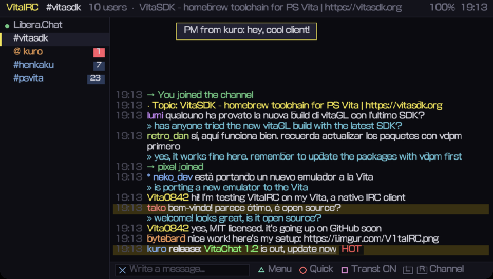 **Chat** with translations, colors and highlights | 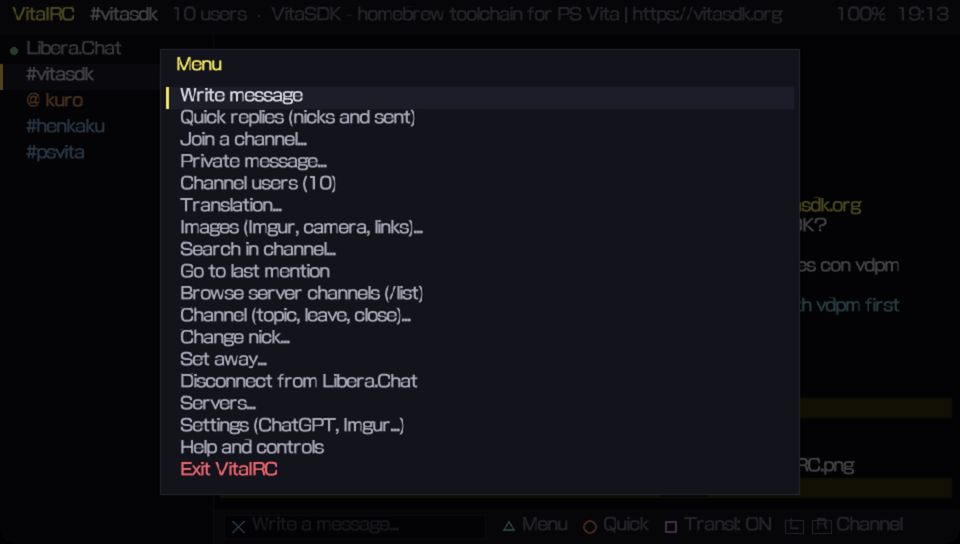 **Main menu** |
| 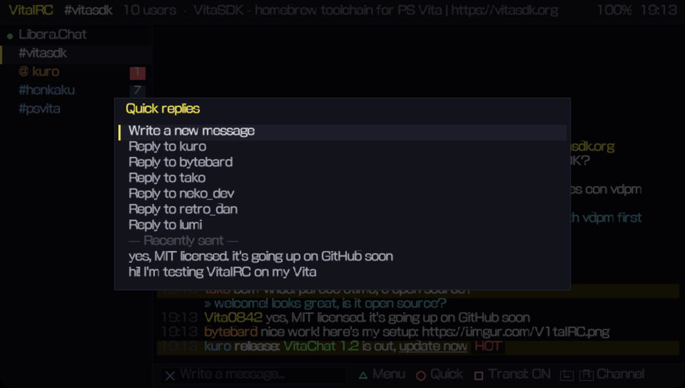 **Quick replies**: recent nicks and sent messages | 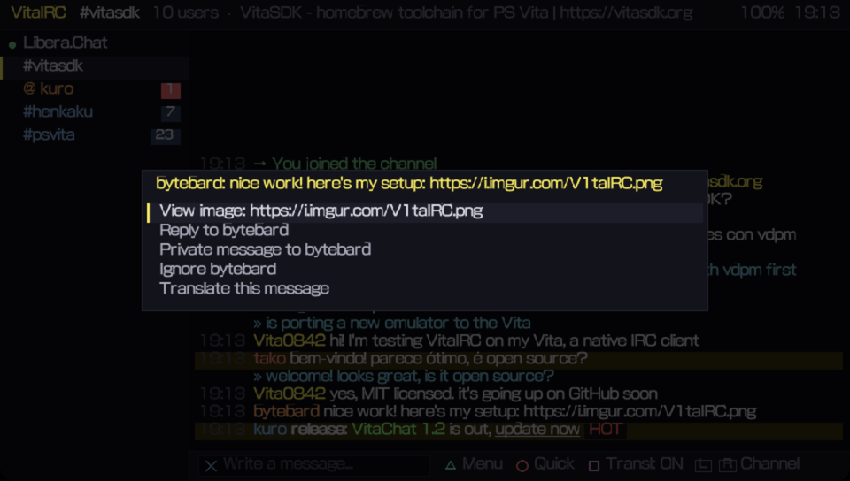 **Tap a message** for its options |
| 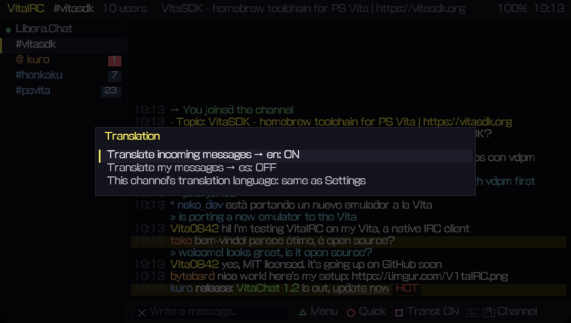 **Translation** settings per channel | 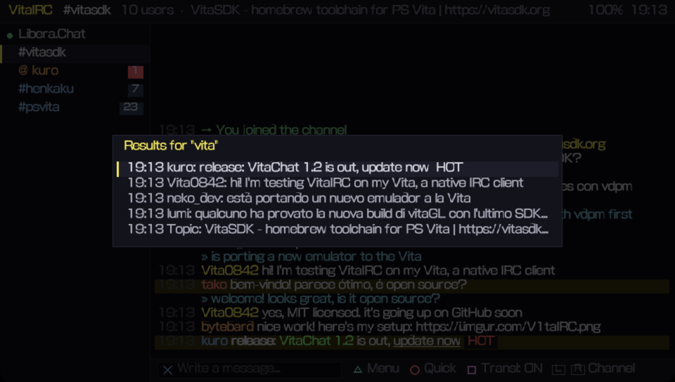 **Search** inside a channel |
| 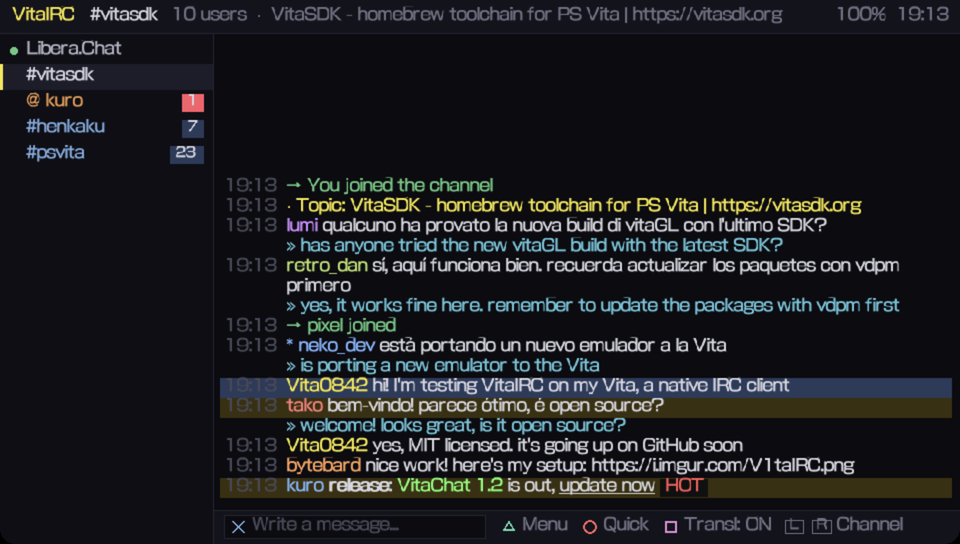 **Jump** to a result or your last mention | 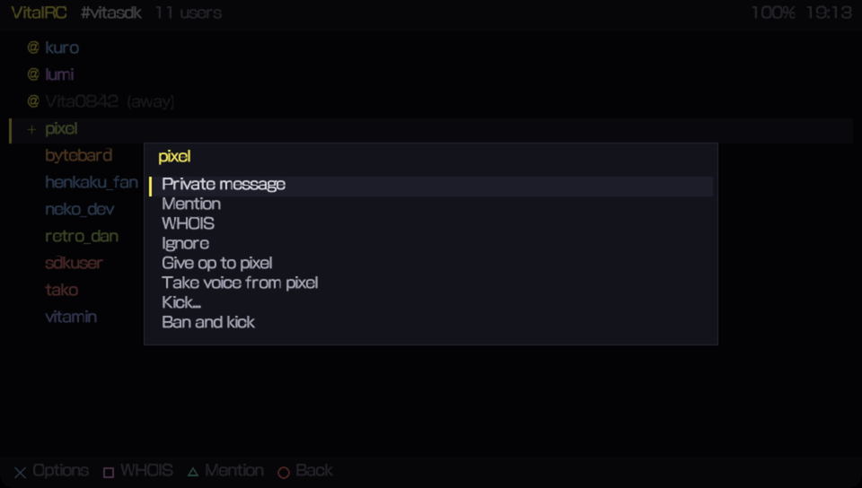 **User list** with operator tools |
| 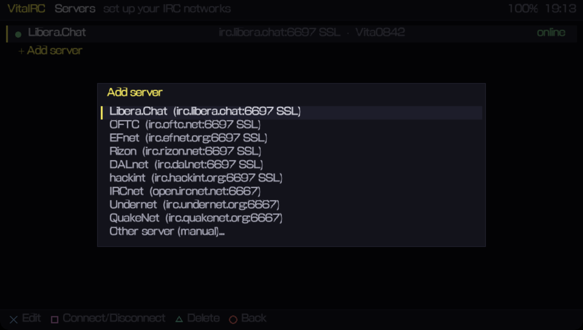 **Network presets** | 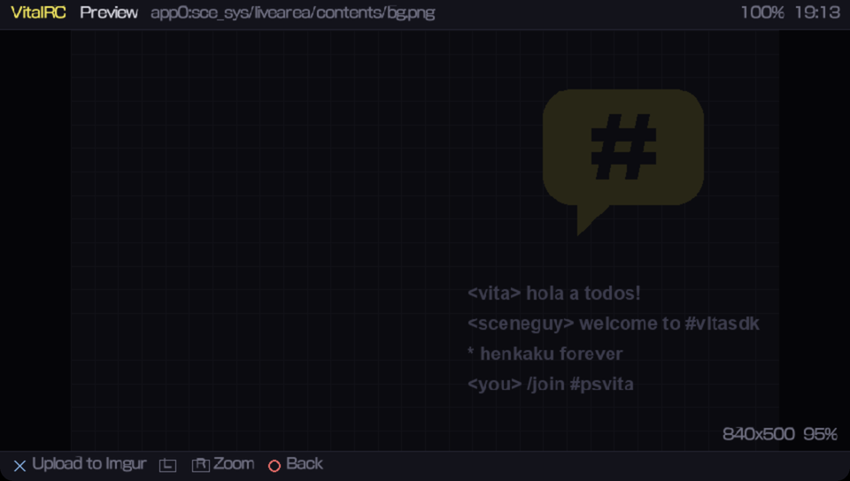 **Image viewer** / upload preview |
| 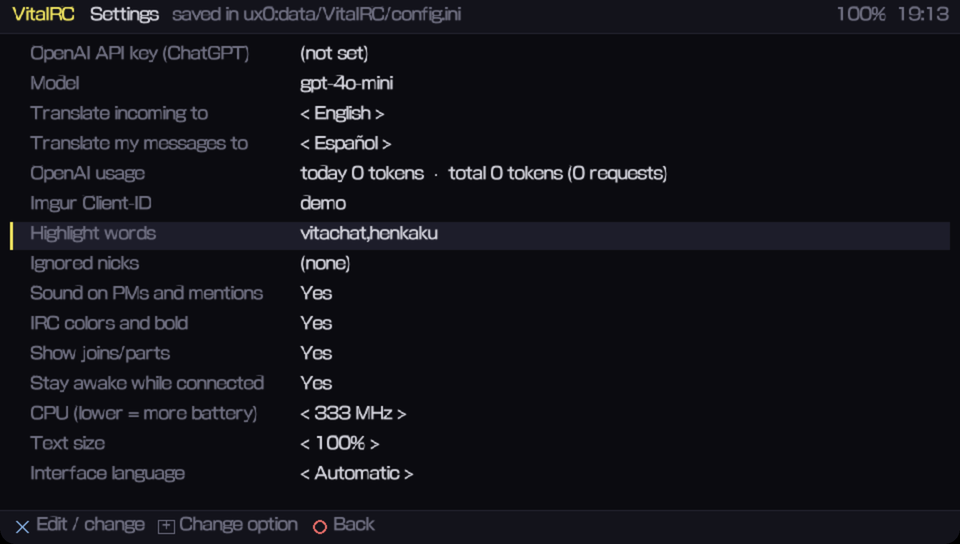 **Settings** | 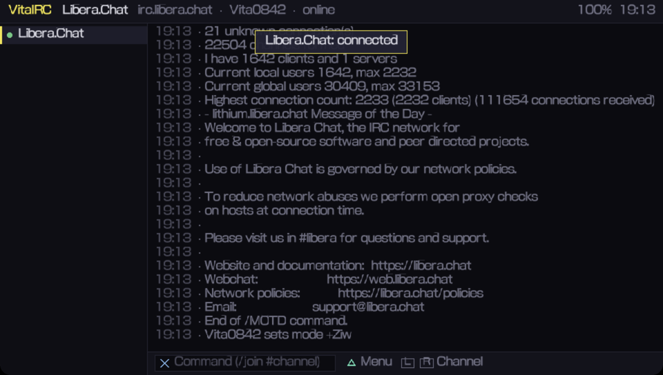 **Server window** |
| 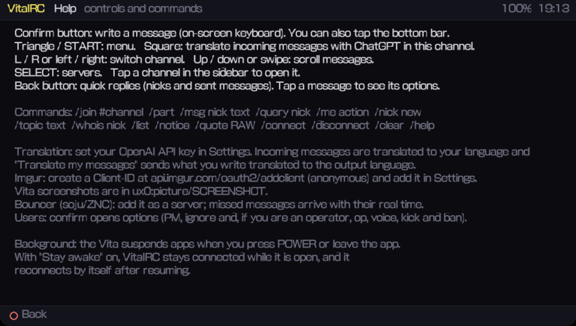 **Built-in help** | 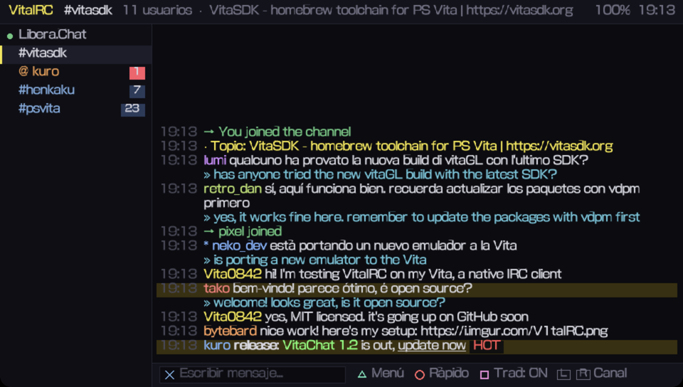 **Spanish interface** |

<sub>Screenshots taken in the Vita3K emulator. Nicknames and conversations are made up.</sub>

## Installation

1. Download `VitaIRC.vpk` from the [Releases](../../releases) page.
2. Copy it to your Vita (VitaShell → FTP or USB).
3. Install it with VitaShell and launch **VitaIRC** from the LiveArea.

Updating is the same: install the new VPK on top; see [Updating](#updating).

## Getting started

On first launch VitaIRC creates `ux0:data/VitaIRC/config.ini` with **Libera.Chat** and `#vitasdk`,
using a random `VitaNNNN` nick, and connects automatically.

- Press **△** for the menu → **Servers...** to change your nick or add networks (pick a preset or
  type your own).
- Press **✕** to type. Messages starting with `/` are commands; `/help` lists them.
- Switch windows with **L/R** or by tapping the sidebar.

## Controls

| Button | Action |
|---|---|
| ✕ (○ on Japanese consoles) | Write a message or command (on-screen keyboard) |
| ○ (✕ on Japanese consoles) | Quick replies, or back to the newest messages when scrolled |
| △ / START | Menu |
| □ | Toggle translation of incoming messages in this channel |
| L / R, ← / → | Previous / next window |
| ↑ / ↓, swipe | Scroll |
| SELECT | Servers |
| Tap a message | Reply, PM, translate, ignore, open links / images |
| Tap the sidebar | Open that channel |
| Tap the bottom bar | Write |

In the user list, **✕** opens the user's options, **□** runs WHOIS and **△** mentions them.

## Commands

| Command | Description |
|---|---|
| `/join #channel [key]` | Join a channel |
| `/part [reason]`, `/close` | Leave the channel / close the window |
| `/msg nick text`, `/query nick [text]` | Private message / open a query window |
| `/me action` | Action (`* nick waves`) |
| `/notice target text` | Send a notice |
| `/nick newnick` | Change nick |
| `/topic [text]` | Show or change the topic |
| `/whois nick` | User information |
| `/list` | Browse the server's channels |
| `/away [reason]`, `/back` | Set or clear away |
| `/ignore [nick]`, `/unignore nick` | Ignore list (wildcards allowed, e.g. `spam*`) |
| `/op`, `/deop`, `/voice`, `/devoice nick` | Channel modes |
| `/kick nick [reason]`, `/ban nick`, `/kickban nick` | Moderation |
| `/connect`, `/disconnect` | Connect / disconnect this server |
| `/quote RAW LINE` | Send a raw IRC line |
| `/clear`, `/help` | Clear the window / show help |

Any other `/COMMAND` is sent to the server as-is.

## Translation with ChatGPT

1. Create an API key at [platform.openai.com](https://platform.openai.com/api-keys).
2. On the Vita: **△ → Settings → OpenAI API key**, and choose your languages.
3. In a channel press **□** (or **△ → Translation...**):
   - **Incoming**: each message gets its translation underneath (`» ...`).
   - **My messages**: type in your language and VitaIRC sends the translation.
   - **This channel's language**: override the global language for this channel only.

The default model is `gpt-4o-mini` (cheap and fast); change it in Settings if you like. Short
messages, links and commands are skipped, results are cached on the memory card, and
**Settings → OpenAI usage** shows the tokens spent today and in total.

> Messages you choose to translate are sent to OpenAI. Leave translation off in channels where
> that is not acceptable.

## Images: Imgur, camera and viewer

- **Imgur Client-ID**: register an application at
  [api.imgur.com/oauth2/addclient](https://api.imgur.com/oauth2/addclient) choosing
  *"Anonymous usage without user authorization"*, and paste the Client-ID in **Settings**.
- **Upload**: **△ → Images... → Upload image to Imgur**, pick a file (Vita screenshots live in
  `ux0:picture/SCREENSHOT`), check the preview and press ✕. The link opens in the keyboard so you
  can add a comment before sending.
- **Camera**: **△ → Images... → Take a photo and upload it**. □ switches between the front and back
  cameras. Photos are saved to `ux0:data/VitaIRC/photos/`.
- **Viewer**: tap a message with an image link (or use **Channel links and images**). PNG and JPG
  open inside the app; GIFs and web pages open in the Vita browser.

## Logging in to Libera.Chat (SASL)

**△ → Servers... →** Libera.Chat **→ ✕** and fill in:

| Field | Value |
|---|---|
| Nick | your registered nick |
| Account (username) | your Libera account name |
| Password | your NickServ password |
| Authentication | **SASL PLAIN** (or **Automatic**) |

Save, then reconnect (□ in the server list). The server window will say
*"SASL authentication successful"*.

**Automatic** uses your password whenever one is set: SASL if the server supports it, NickServ
IDENTIFY otherwise. If your nick is still taken by an old session (for example, you closed the app
from the LiveArea and reopened it within a few minutes), VitaIRC asks NickServ to `REGAIN` it for you. No account yet? From the server window:
`/msg NickServ REGISTER yourpassword you@example.com`.

## Never miss a message: bouncers

The Vita freezes apps when it sleeps or when you leave them, so no client running on the Vita can
stay online 24/7. The proper fix is a **bouncer** (soju or ZNC) on any always-on machine
(a Raspberry Pi, a VPS...). Add it to VitaIRC as a normal server:

| Bouncer | Authentication | Account | Password |
|---|---|---|---|
| **soju** | SASL PLAIN | `user/network@vita` | your soju password |
| **ZNC** | Server PASS | — | `user/network:password` |

When you connect, the bouncer replays what you missed, and thanks to IRCv3 `server-time` every
message keeps its real timestamp.

## Configuration file

Everything can be changed from the app, or by editing `ux0:data/VitaIRC/config.ini` with VitaShell:

```ini
[general]
openai_key=sk-...
openai_model=gpt-4o-mini
lang_in=en               ; translate incoming messages to this language
lang_out=es              ; translate my messages to this language
imgur_client_id=xxxxxxxxxxxxxxx
show_joins=1
keep_awake=1
cpu_mhz=333              ; 222 / 333 / 444
font_pct=100             ; 85 / 100 / 115 / 130
ui_lang=0                ; 0 system, 1 Spanish, 2 English
sound=1
irc_colors=1
highlight=vitashell,henkaku
ignore=spambot*,troll

[server]
name=Libera.Chat
host=irc.libera.chat
port=6697
ssl=1
nick=MyNick
user=myaccount
realname=VitaIRC user
password=
auth=2                   ; 0 automatic, 1 NickServ, 2 SASL PLAIN, 3 server PASS
channels=#vitasdk,#henkaku
autoconnect=1
```

Translation languages: `es en pt fr de it ja ru zh ko`.

## Updating

Install the new VPK on top of the old one. Only the app in `ux0:app/VIRC00001/` is replaced;
your servers, channels, settings and history in `ux0:data/VitaIRC/` are kept.

## Where your data lives

| Path | Contents |
|---|---|
| `ux0:data/VitaIRC/config.ini` | Settings and servers |
| `ux0:data/VitaIRC/logs/<server>/<channel>.log` | Chat history (plain text, trimmed automatically at 512 KB) |
| `ux0:data/VitaIRC/session.txt` | Open windows and their translation settings |
| `ux0:data/VitaIRC/trcache.txt` | Translation cache |
| `ux0:data/VitaIRC/usage.txt` | OpenAI token counters |
| `ux0:data/VitaIRC/photos/` | Photos taken with the camera |

> API keys and passwords are stored **in plain text** on the memory card.

## Limitations

- **No background connection.** The Vita suspends apps when you press POWER or leave them. With
  *"Stay awake while connected"* on, VitaIRC prevents auto-sleep while a server is connected
  (the screen may still dim), and it reconnects by itself after resuming. Use a bouncer to keep
  everything you miss.
- The system font has no emoji; some symbols may show as boxes.
- GIF images open in the browser instead of the built-in viewer.

## Building from source

Requirements: [VitaSDK](https://vitasdk.org) and CMake.

```sh
# install VitaSDK (see vitasdk.org), then the libraries:
vdpm install libvita2d curl-mbedtls mbedtls zlib libpng

export VITASDK=/usr/local/vitasdk   # or wherever you installed it
git clone https://github.com/YOUR_USERNAME/VitaIRC.git
cd VitaIRC
./build.sh                           # -> dist/VitaIRC.vpk
```

`vita-pack-vpk` doesn't handle spaces in paths; `build.sh` works around that automatically.

**GitHub Actions**: [`.github/workflows/build.yml`](.github/workflows/build.yml) builds the VPK on
every push and uploads it as an artifact. Pushing a tag like `v1.0` publishes a release with the
VPK attached.

## Project layout

| Path | Contents |
|---|---|
| `src/main.c` | UI (vita2d), input, on-screen keyboard, screens and menus |
| `src/irc.c` | IRC protocol, one thread per server, channels, users, commands |
| `src/conn.c` | Sockets + TLS (mbedTLS) |
| `src/net.c` | HTTP worker: OpenAI translation, Imgur uploads, image downloads (libcurl) |
| `src/history.c` | Chat logs and open-window session |
| `src/config.c` | `config.ini` reading and writing |
| `src/i18n.c` | English strings (generated by `tools/i18n_gen.py`) |
| `src/camera.c` | Vita camera + JPEG encoding |
| `src/sound.c` | Notification chime |
| `src/minijson.c` | Minimal JSON reader |
| `sce_sys/` | Icon and LiveArea assets |
| `res/cacert.pem` | CA certificates used to verify TLS connections |

## Development tools

- **Translations**: UI strings are written in Spanish in the source and wrapped in `T("...")`.
  Add the English text to the table in `tools/i18n_gen.py` and run `python3 tools/i18n_gen.py`
  to regenerate `src/i18n.c`. Contributions of new languages are welcome.
- **Screenshots without a console** (macOS + [Vita3K](https://vita3k.org)): the demo build walks
  through every screen with made-up data and `tools/vita3k-shots.sh` captures them:

  ```sh
  cmake -S . -B build-demo -DVITAIRC_DEMO_EN=ON && cmake --build build-demo
  tools/vita3k-shots.sh build-demo/VitaIRC.vpk     # -> screenshots/
  ```

  The demo code is never included in normal builds.

## Credits

- [VitaSDK](https://vitasdk.org) and the people behind [HENkaku](https://henkaku.xyz) / Ensō.
- [vita2d](https://github.com/xerpi/libvita2d), [mbedTLS](https://www.trustedfirmware.org/projects/mbed-tls/),
  [libcurl](https://curl.se), [libjpeg-turbo](https://libjpeg-turbo.org), [zlib](https://zlib.net), [libpng](http://www.libpng.org).
- [Vita3K](https://vita3k.org), used to test the interface.

## License

[MIT](LICENSE). Use it, fork it, improve it. Pull requests are welcome.
